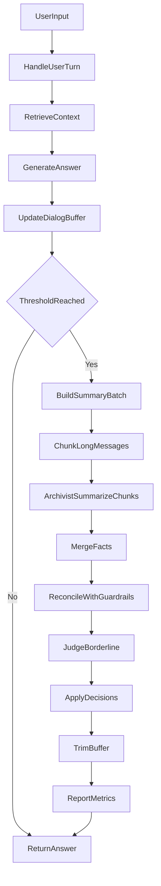

# План на завтра: максимальный апгрейд памяти Jasseya

## Цель дня
За один рабочий день сделать память заметно точнее и предсказуемее: убрать ложные совпадения, повысить качество извлечения фактов из длинных сообщений, изолировать Архивариуса в отдельный пакет внутри текущего репозитория и подготовить прозрачную диагностируемую базу для дальнейших улучшений.

## Главные результаты дня (что считаем успехом)
- Поток данных по памяти полностью задокументирован: от пользовательского ввода до сохранения/замены факта.
- Архивариус вынесен в отдельный пакет внутри репозитория и подключён через явный интерфейс.
- В `reconcile` внедрена калибровка решений (score + guardrails), чтобы уменьшить ложные `SKIP`.
- Добавлен управляемый чанкинг длинных сообщений перед суммаризацией.
- Есть набор тестов и метрик до/после, подтверждающий улучшение качества.

## Исходные файлы, от которых отталкиваемся
- [main.py](/home/user/Рабочий стол/Jasseya/main.py)
- [config.py](/home/user/Рабочий стол/Jasseya/config.py)
- [app/application/chat/use_cases/handle_user_turn.py](/home/user/Рабочий стол/Jasseya/app/application/chat/use_cases/handle_user_turn.py)
- [app/application/memory/use_cases/run_memory_pipeline.py](/home/user/Рабочий стол/Jasseya/app/application/memory/use_cases/run_memory_pipeline.py)
- [app/infrastructure/llm/openai_gateway.py](/home/user/Рабочий стол/Jasseya/app/infrastructure/llm/openai_gateway.py)
- [app/domain/memory/policies.py](/home/user/Рабочий стол/Jasseya/app/domain/memory/policies.py)
- [app/core/logging.py](/home/user/Рабочий стол/Jasseya/app/core/logging.py)

## Приоритеты на день
1. **Качество решений памяти** (самый важный блок): калибровка `reconcile` + guardrails.
2. **Качество извлечения фактов**: чанкинг длинных реплик перед суммаризацией.
3. **Архитектурная чистота**: выделение Архивариуса в отдельный пакет в repo.
4. **Наблюдаемость и тесты**: чтобы не гадать, а видеть, что улучшилось.

## План работ по этапам

## Этап 1. Полный быстрый аудит потока данных (утро)
**Цель:** перед изменениями зафиксировать реальное поведение.

**Что делаем:**
- Пройти по пути выполнения: `main -> client -> handle_user_turn -> run_memory_pipeline -> gateway/vectorstore`.
- Зафиксировать точки ветвления, где теряется качество:
  - извлечение фактов,
  - сравнение похожести,
  - решения `REPLACE/ADD/IGNORE`.
- Снять baseline-метрики на 10–20 ручных кейсах:
  - сколько фактов извлекается,
  - сколько ложных дублей,
  - сколько явно неверных `SKIP`.

**Артефакт этапа:** `docs/memory/baseline-audit.md` с таблицей кейсов и проблем.

## Этап 2. Выделить Архивариуса в отдельный пакет внутри репозитория
**Цель:** отделить логику суммаризации/нормализации фактов от общего gateway.

**Целевая структура (внутри repo):**
- `app/archivist/`
  - `contracts.py` — вход/выход Архивариуса
  - `service.py` — orchestration Архивариуса
  - `prompts.py` — prompt-конфигурация и шаблоны
  - `parser.py` — разбор и валидация JSON
  - `normalizer.py` — очистка/дедуп фактов

**Что делаем:**
- Вынести из `openai_gateway` весь код, связанный с `summarize_dialog_batch`.
- Оставить в gateway только transport-вызовы LLM.
- Подключить Архивариуса в pipeline через явный интерфейс.

**Критерий готовности:** `run_memory_pipeline` не знает деталей prompt/parsing Архивариуса.

## Этап 3. Калибровка памяти в reconcile (core quality)
**Цель:** снизить ложные совпадения и не терять релевантные факты.

**Что внедряем:**
- Решение не только по score: `score + guardrails`.
- Guardrails для принудительного `JUDGE`:
  - конфликт субъекта (`я/мне/мой` vs `Имя`),
  - конфликт отрицания (`не/нет`),
  - конфликт типа факта (`identity` vs `pet` vs `preference`).
- Обновить стратегию порогов:
  - оставить/перепроверить `LOW`,
  - держать высокий `HIGH` (ближе к 0.985),
  - при `score > HIGH` и наличии guardrail — не `SKIP`, а `JUDGE`.

**Где меняем:**
- [app/domain/memory/policies.py](/home/user/Рабочий стол/Jasseya/app/domain/memory/policies.py)
- [app/application/memory/use_cases/reconcile_facts.py](/home/user/Рабочий стол/Jasseya/app/application/memory/use_cases/reconcile_facts.py)
- [config.py](/home/user/Рабочий стол/Jasseya/config.py)

**Критерий готовности:** кейс типа «Собаку Вадима зовут Бобик» vs «Меня зовут Вадим» не уходит в автоматический `SKIP`.

## Этап 4. Внедрить чанкинг длинных сообщений (без внешней библиотеки)
**Цель:** улучшить извлечение фактов из длинных реплик/батчей.

**Подход:** собственный `SentenceChunker` (лёгкий и прозрачный).

**Что реализуем:**
- Новый модуль чанкинга в домене/приложении памяти.
- Чанкинг только для длинных сообщений (порог длины).
- Разбиение по предложениям + ограничение по приблизительным токенам/словам.
- Небольшой overlap (1 предложение) для контекстной связности.
- Суммаризация по чанкам и merge итоговых фактов.

**Рекомендуемые стартовые параметры:**
- `min_chars_for_chunking`: 220–300
- `target_chunk_tokens`: 80–180
- `overlap_sentences`: 1

**Где интегрируем:**
- до вызова Архивариуса в [app/application/memory/use_cases/run_memory_pipeline.py](/home/user/Рабочий стол/Jasseya/app/application/memory/use_cases/run_memory_pipeline.py)

## Этап 5. Усилить наблюдаемость и отладку
**Цель:** любое неверное решение памяти должно быть объяснимо из логов.

**Что добавляем в логи:**
- `decision`, `reason`, `score`, `old_fact`, `new_fact` (при необходимости маскировать),
- guardrail-признаки: `subject_conflict`, `negation_conflict`, `type_conflict`,
- данные чанкинга: число чанков, длина чанков, время суммаризации по чанкам.

**Где усиливаем:**
- [app/core/logging.py](/home/user/Рабочий стол/Jasseya/app/core/logging.py)
- `reconcile`, `pipeline`, `archivist`.

## Этап 6. Тесты, регрессионные сценарии, критерии качества
**Цель:** зафиксировать улучшения цифрами, а не ощущениями.

**Набор обязательных тестов:**
- Пороговые сценарии `LOW/HIGH`.
- Guardrail-сценарии:
  - субъектный конфликт,
  - отрицание,
  - конфликт типа факта.
- Чанкинг:
  - короткое сообщение не чанкуется,
  - длинное корректно делится,
  - merge чанков не плодит дубли.
- Интеграционный сценарий `run_memory_pipeline` с `SAVE/JUDGE/SKIP`.

**Минимальные KPI “после” относительно baseline:**
- ложные `SKIP` снижаются минимум на 30%,
- извлечение полезных фактов из длинных сообщений растёт минимум на 20%,
- нет регрессий по существующим позитивным кейсам.

## Этап 7. Финальная сборка и документация
**Цель:** оставить после дня понятную систему для дальнейшего развития.

**Что обновляем:**
- README (как теперь работает память и Архивариус),
- документ по калибровке порогов и guardrails,
- руководство «как добавлять новые правила reconcile».

**Маршрут чтения для команды:**
1) `handle_user_turn`
2) `run_memory_pipeline`
3) `archivist/service`
4) `reconcile_facts + policies`
5) `vectorstore + logging`

## План по времени (реалистичный)
- 10:00–11:30: аудит + baseline.
- 11:30–14:00: вынос Архивариуса в пакет.
- 15:00–17:30: калибровка reconcile + guardrails.
- 17:30–19:00: чанкинг + интеграция.
- 19:00–20:00: тесты, метрики, документация.

## Поток данных после апгрейда

## Риски и защита
- Риск: рост латентности из-за чанкинга.
  - Защита: включать чанкинг только для длинных сообщений + ограничить число чанков.
- Риск: переусложнение правил reconcile.
  - Защита: каждое правило покрыто тестом и имеет лог-причину срабатывания.
- Риск: поломка интеграции после выноса Архивариуса.
  - Защита: контрактные тесты входа/выхода Архивариуса и постепенное переключение.

## Definition of Done на конец завтрашнего дня
- Архивариус выделен в отдельный пакет внутри репозитория и подключён в pipeline.
- Чанкинг длинных сообщений работает и не применяется к коротким.
- Guardrail-калибровка reconcile внедрена и логируется.
- Пройдены тесты и есть документированные baseline/after метрики.
- Память заметно стабильнее на проблемных кейсах без ухудшения базовых сценариев.